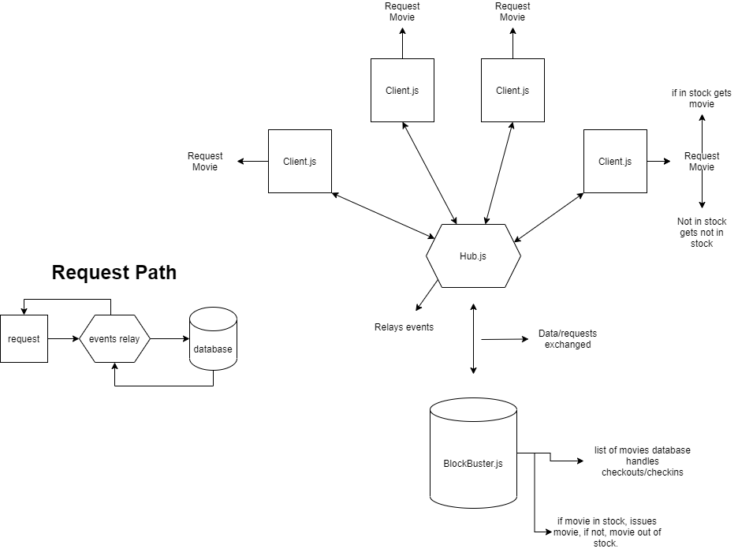

# Blockbuster App

## Directory

1. [Authors/Links](###Authors)
3. [Setup](###Setup)
4. [UML/How to](##How-to)

small team app for events, using a blockbuster style checkout of movies

## Project: Block Buster style app

### Authors: 
- Ryan Geddes
- Edgar Romero 
- Chris Bortel 
- Brendon Hampton

### Links and Resources

- [submission PR](https://github.com/brendon-401-advanced-javascript/blockbuster/pull/6)
- [PowerPoint](https://docs.google.com/presentation/d/1UwZUd1zSywUAF1Kohuf-iOW0U0uS_KBK12q3K6BtctM/edit?usp=sharing)
- [ci/cd](https://github.com/brendon-401-advanced-javascript/blockbuster/actions) (GitHub Actions)
- [back-end server url](http://xyz.com) (when applicable)
- [front-end application](http://xyz.com) (when applicable)

### User Stories

* As a user, I want to be able to request to checkout a Movie.
* As a User, I want to know if a movie that I request is in stock or not available.

### Setup

1. npm I for the socket.io dependancies
2. Create a file in your vs code **Client.js**
### --Paste code Below into your created file--
    'use strict';

    const io = require('socket.io-client');

    let host = 'http://localhost:3000';

    const hubConnection = io.connect(host);

    setInterval(() => {
    let movies = [
        'Lord of The Rings',
        'Dirty Dancing',
        'Mission Impossible',
        'Hard to Kill',
    ];

    let randomMovie = movies[Math.floor(Math.random() * movies.length)];
    // console.log(randomMovie);

    hubConnection.emit('request', randomMovie);
    }, 1000);

    hubConnection.on('check-out', (payload) => {
    if (payload.status === 'in stock') {
        console.log('you checked out', payload);
    } else {
        // console.log(payload);
    }

    setInterval(() => {
        console.log('you checked in', payload);
        hubConnection.emit('check-in', payload.name);
    }, 5000);
    });

    

## How to
 How to initialize/run your application (where applicable)

- if nodemon installed:
    - run nodemon on root where your package.json is located.
- else 
    - run **node client.js** in terminal where your file is located.
    
## UML

